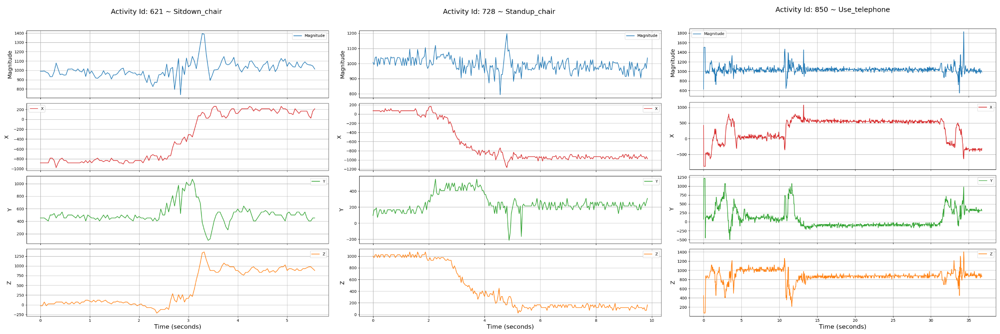

# 📌 Human Activity Recognition Dataset for the Open Seizure Database


## 📖 Overview
This dataset is designed for **Human Activity Recognition (HAR)** and has been adapted for integration with the **Open Seizure Database (OSDB)**. It originates from the **Public Dataset of Accelerometer Data for Human Motion Primitives Detection Dataset**, capturing a diverse range of everyday activities. The primary goal is to utilise these high-quality activity recordings to help seizure detection models distinguish between normal human movements and those that trigger false alarms.

A small sample CSV file of real seizure events from the OSDB has been included in the Datasets folder. Request access to the full OSDB [here](mailto:graham@openseizuredetector.org.uk) 

### 📂 Activities Included

| Activity          | Samples |
|------------------|---------|
| 🪥 brush_teeth   | 12      |
| 🏃 climb_stairs  | 102     |
| 💇 comb_hair     | 31      |
| 🏃‍⬇️ descend_stairs | 42  |
| 🥛 drink_glass   | 100     |
| 🍖 eat_meat      | 5       |
| 🍲 eat_soup      | 3       |
| 🛏️ getup_bed     | 101     |
| 🛏️ liedown_bed   | 28      |
| 💦 pour_water    | 100     |
| 🪑 sitdown_chair | 100     |
| 🏋️ standup_chair | 102     |
| 📞 use_telephone | 13      |
| 🚶 walk          | 100     |




### 📊 Sensor Specifications

- **Type:** Tri-axial accelerometer
- **Output Data Rate:** 32 Hz (original), **downsampled to 25 Hz** for OSDB compatibility
- **Sensor Placement:** Right wrist
  - **x-axis:** Points towards the hand
  - **y-axis:** Points towards the left
  - **z-axis:** Perpendicular to the plane of the hand


### 🔧 Data Processing

Since OSDB operates at **25 Hz**, the dataset was **downsampled using `downsampling.py`** to match this frequency. Each event was segmented into sequences of **125 data points**, ensuring alignment with OSDB's temporal structure. Additionally, a **rawData column** (`magnitude`) was computed to be consistent with the OSDB `rawData` column, 

The formula for rawData is $ \text{magnitude} = \sqrt{x^2 + y^2 + z^2} $.

To enable seamless integration with OSDB, the following modifications were applied:
- Each activity was assigned an **`eventId`**, prefixed with `99999_` to avoid conflicts with existing OSDB event IDs.
- A **`userId`** column was introduced to retain user identity across activities.
- An **`Id`** column was added to preserve row order within each event.
- A **`label`** column was included to classify each event according to its corresponding activity.

As a result, the transformed dataset produces an OSDB-compatible dataframe where every **125 rows** represents a single **timestep sequence**, containing data points for **x, y, z** and **rawData (`magnitude`)**.

---


```plaintext

   eventId  Id userId           x           y           z    rawData         label
0       1   1     f1 -452.380952  833.333333  166.666667   962.741268  Brush_teeth
1       1   2     f1 -452.380952  976.190476  166.666667  1088.748892  Brush_teeth
2       1   3     f1 -452.380952  976.190476  166.666667  1088.748892  Brush_teeth
3       1   4     f1 -476.190476  952.380952  119.047619  1071.428571  Brush_teeth
4       1   5     f1 -547.619048  880.952381  166.666667  1050.591023  Brush_teeth
```

---

## 🚀 How to Use

### 🔹 Installation

Clone the repository and install dependencies:

```sh
# Clone the repository
git clone https://github.com/jpordoy/Human_Activity_OSDB_Dataset.git
cd yourrepo

# Install dependencies
pip install -r requirements.txt
```

## Usage
Run the following commands from the terminal inside the project directory.

### 1. Process OSDB Activity Data
Downsample the raw data from 32Hz to 25Hz and save as a CSV.

```bash 
python main.py --process_data
```

### 2. Analyse the Processed Data
Analyses the downsampled dataset.
```bash
python main.py --analyze_data
```

### 3. Vectorized Activity Data
Convert the dataset into a Vectorised Representation (Each row represents 5 seconds of sensor data).
```bash
python main.py --restructure_data
```

### 4. Generate Seizure/Activity Dataset
Concatenate a small sample of OSDB events with the human activity dataset. 
```bash
python main.py --generate_data
```

### 🔹 Data Structure

```sh
📁 Human_Activity_OSDB_Dataset/
│── 📁 Datasets/                  # Outputted data
│   │── 📁 activity_dataset.csv #Downsampled activity dataset at 25Hz for timeseries
│   │── 📁 restructured_data.csv #Downsampled activity dataset at 25Hz, vectorised into rows representing 5 seconds per row
│   │── 📁 sample_osdb_data.csv # Small sample of events with x,y,z and rawData (magnitude) from the OSDB
│   │── 📁 seizure_activity_combined.csv # Example dataset combining the OSDB events and the human activities into a single dataset

│── 📁 Data/
│   │── 📁 Dataset/         # Human activity dataset (32 Hz)
│   │   │── 📁 Brush_teeth
│   │   │── 📁 Climb_stairs
│   │   │── 📁 Comb_hair
│   │   │── 📁 Descend_stairs
│   │   │── 📁 Drink_glass
│   │   │── 📁 Eat_meat
│   │   │── 📁 Eat_soup
│   │   │── 📁 Getup_bed
│   │   │── 📁 Liedown_bed
│   │   │── 📁 Pour_water
│   │   │── 📁 Sitdown_chair
│   │   │── 📁 Standup_chair
│   │   │── 📁 Use_telephone
│   │   │── 📁 Walk
│── 📁 Models/                  # Directory for model files
│   │── 📁 Early_Stopping       # Early stopping model configuration
│   │── 📄 model.keras   # HAR event classifier
│── 📁 Scripts/                 # Scripts for data processing and model training
│   │── 📄 lstm_model.ipynb   # Classifier
│── 📄 .gitignore               # Git ignore file
│── 📄 requirements.txt         # Python dependencies
│── 📄 README.md                # Project documentation
│── 📄 activity_data_osdb_processor.py # Python downsampling script
│── 📄 data_generator.py        # Concatenates the OSDB sample data with the downsampled activity data
│── 📄 data_restructurer.py     # Restructures the activity data from timeseries to vectorized
│── 📄 data_analyser.py         # Analyzes the activity dataset once downsampled to provide a statistical overview
│── 📄 main.py                  # Main script to run code
```
---

## 📁 Model
Two baseline neural networks are included for classifying seizure and activity data. These models have been designed to help users begin research into the use of activity data for seizure detection. They provide reasonable accuracy scores and performance, serving as starting points for further research and refinement.

- 📁 **Activity Model**: This model is trained using only the activity data from activity_dataset.csv
- 📁 **OSDB + Activity Model**: This model is trained using both the OSDB dataset and the activity data from activity_dataset.csv.
- 💻 **Training Script**: To train or fine-tune the model, open the **Jupyter notebook** files in the **Scripts** folder and click **run all**.
- 🧠 **Trained Models**: Models are stored in **Models** directory in the **.keras** format.


| Id  | Model                | Dataset                                    | Train Accuracy | Train Loss | Val Accuracy | Val Loss | Test Accuracy | Test Loss |
|-----|----------------------|--------------------------------------------|----------------|------------|--------------|----------|----------------|-----------|
| 1   | osdb_activity_model   | OSDB + activity_dataset.csv                | 88.8%          | 0.3004     | 91.8%        | 0.2105   | 92.2%          | 0.2094    |
| 2   | activity_model        | activity_dataset.csv                       | 80.17%         | 0.5945     | 84.67%       | 0.4832   | 84.67%         | 0.4832    |


Th experiments for Id:1 used the full number of compatible events from the OSDB. The datasets genereated in this repository contains a small sample of that data. To access the full dataset, request access to the Open Seizure Database [here](mailto:graham@openseizuredetector.org.uk)


---

## 📜 Citation & Acknowledgments
This dataset is built upon the **Human Motion Primitives (HMP) dataset**, and we acknowledge the contributions of the researchers who originally developed it. If you use this dataset in academic work or peer-reviewed research, please cite the following references to properly attribute their efforts:

```bibtex
@inproceedings{BRUNO13,
  author    = {Bruno, B. and Mastrogiovanni, F. and Sgorbissa, A. and Vernazza, T. and Zaccaria, R.},
  title     = {Analysis of human behavior recognition algorithms based on acceleration data},
  booktitle = {IEEE International Conference on Robotics and Automation (ICRA)},
  pages     = {1602--1607},
  year      = {2013}
}

@inproceedings{BRUNO12,
  author    = {Bruno, B. and Mastrogiovanni, F. and Sgorbissa, A. and Vernazza, T. and Zaccaria, R.},
  title     = {Human motion modelling and recognition: A computational approach},
  booktitle = {IEEE International Conference on Automation Science and Engineering (CASE)},
  pages     = {156--161},
  year      = {2012}
}

```