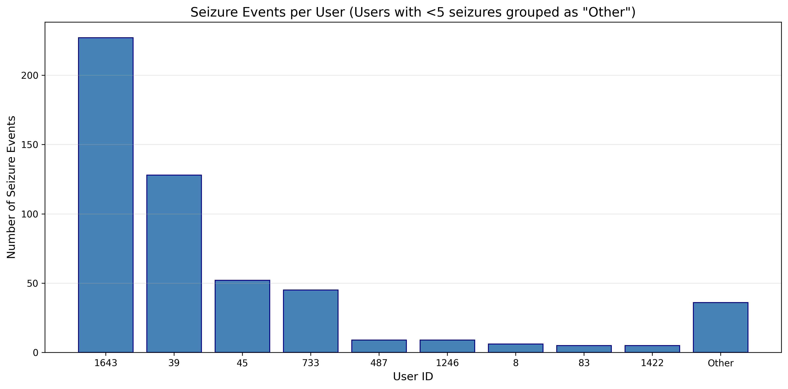
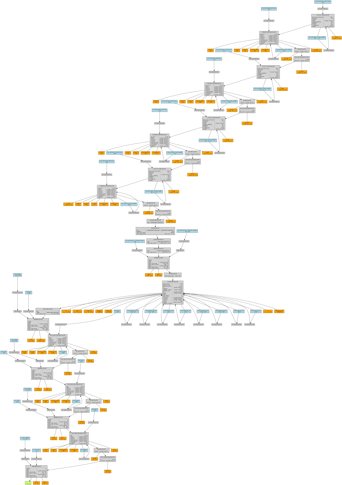
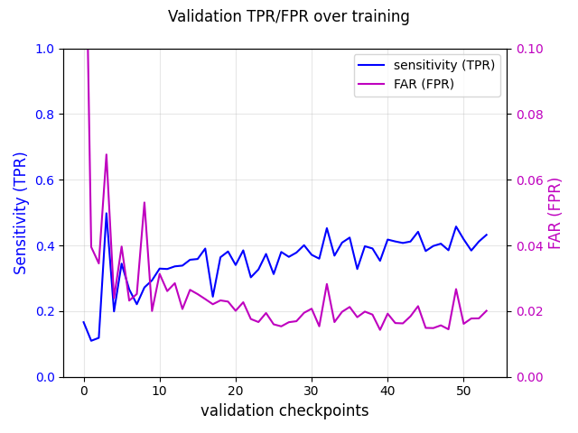
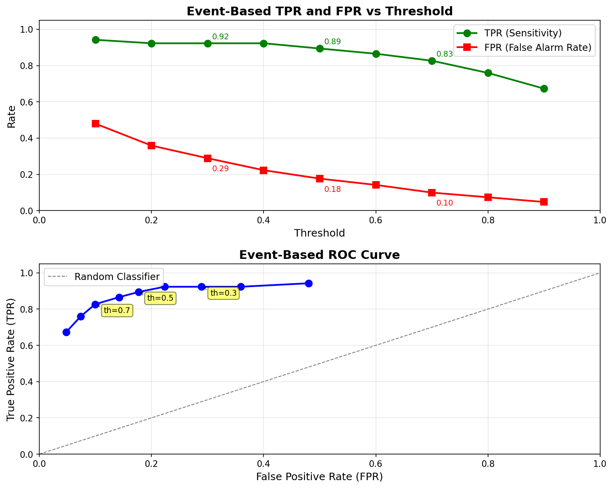
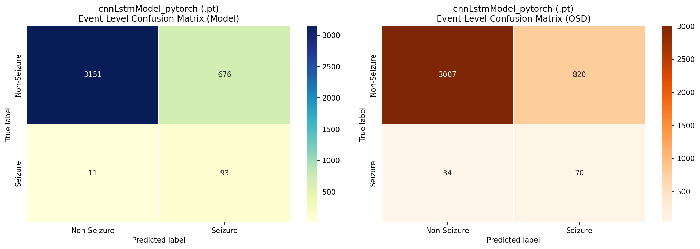

# OpenSeizureDetector: CNN-LSTM Machine Learning Algorithm: Training and Validation Report

**OpenSeizureDatabase Version:** 1.11  
**Report Date:** August 29, 2026  
**Model Architecture:** CNN-LSTM (Convolutional Neural Network with Long Short-Term Memory)

---

## Executive Summary

This report presents the training and validation results for a CNN-LSTM seizure detection model trained on the OpenSeizureDatabase (OSDB) Version 1.11. The model demonstrates strong performance with a True Positive Rate (TPR) of 89% and False Positive Rate (FPR) of 18% on the production test set. 

Nested k-fold cross-validation was performed using both 3×3 and 5×5 configurations to assess model generalization. 
The 3x3 nested k-fold cross validation demonstrated good model generalisation and performance consistent with the production training run.

**Key Finding:** The 5×5 nested cross-validation shows higher FPR (25.3% ± 5.0%) compared to both the production run (18%) and 3×3 validation (18.7% ± 1.2%). This discrepancy is primarily attributed to increased statistical variability from smaller test set sizes and higher sensitivity to data partitioning in the 5-fold scheme.   This suggests that for the dataset size that we have, using 3x3 nested k-fold validation is more appropriate to demonstrate that the model generalises to unseen data correctly.

---

## 1. Dataset Description

### 1.1 Data Source

The training dataset was derived from the OpenSeizureDatabase [1] Version 1.11, which contains accelerometer and heart rate data from wearable devices worn by individuals with epilepsy. The data was contributed by users of the Open Seizure Detector application [2] and was labelled as Seizure or False Alarm by the contributors.  

The contributed data is consolidated into an anonymised dataset by the Open Seizure Detector maintainer, who also annotates the seizure data to mark the start and end of the seizure movement for use in analysis.

The database is licenced under an open license [3] which requires attribution and the publishing of work in order that the OpenSeizureDetector users and contributors can benefit from the work.   This report is intended to meet the requirements of the licence.


### 1.2 Dataset Composition

**Total Dataset:**
- **Total Events:** 522 seizure events + 19,152 non-seizure events = 19,674 events
- **Contributors:** 30 unique users with seizure data

It should be noted that while 30 unique users have contributed seizure data, only 9 users have contributed 5 or more seizures, so dominate the dataset as shown below:



**Training/Test Split (Run 5 - Production):**
For the production training run (Run 5) an 80%/20% split between training and validation/test was used, so the production model was trained on the following: 
- **Training Set:** 418 seizure events, 15,304 non-seizure events
- **Validation & Test Set:** 104 seizure events, 3,827 non-seizure events

### 1.3 Seizure Type Distribution

The production (Run 5) validation/test set contains the following seizure types:

| Seizure SubType | Count | Percentage |
|----------------|-------|------------|
| Tonic-Clonic   | 61    | 58.7%      |
| Aura           | 19    | 18.3%      |
| Other          | 21    | 20.2%      |
| Suspected      | 2     | 1.9%       |

**Note:** Tonic-clonic seizures represent the most clinically significant events and are the primary focus for detection performance.

### 1.4 Data Processing

- **Sampling Frequency:** 25 Hz (from data source)
- **Feature:** Accelerometer magnitude (3-axis accelerometer data combined into single magnitude) in units of g so they are close to unity.
- **Temporal Windowing:** 
  - CNN windows: 1-second segments (25 samples)
  - LSTM sequences: 30-second sequences (30 time steps of 1-second features)
- **Seizure Time Constraint:** Training limited to annotated seizure time windows for seizure events with 0-second margin
- **Data Augmentation:** 
  - Noise augmentation (factor: 10, value: 30.0)
  - User-based augmentation to balance seizure events across contributors

---

## 2. Model Architecture

### 2.1 CNN-LSTM Hybrid Architecture

The model employs a two-stage architecture:

1. **CNN Feature Extractor:**
   - Extracts spatial features from 1-second accelerometer windows
   - Convolutional layers with dropout (0.08)
   - Outputs 64-dimensional feature vectors

2. **LSTM Temporal Processor:**
   - Processes sequences of 30 CNN feature vectors (30-second context)
   - 2 stacked LSTM layers with 128 hidden units each
   - LSTM dropout: 0.25
   - Captures temporal patterns and seizure dynamics

3. **Classification Head:**
   - Fully connected layers with dropout (0.15)
   - Binary classification (seizure vs. non-seizure)



### 2.2 Training Configuration

**Hyperparameters:**
- **Epochs:** 150 (with early stopping, patience=8)
- **Batch Size:** 256
- **Optimizer:** AdamW (β₁=0.9, β₂=0.999)
- **Weight Decay:** 0.002
- **Learning Rate Schedule:** Three-phase schedule (Spahr et al. 2025)
  - Warmup: 3,750 steps to peak LR of 1×10⁻⁴
  - Main training: 157,500 steps, decay to 3×10⁻⁵
  - Cooldown: 3,750 steps
- **Balanced Batching:** Yes (equal seizure/non-seizure samples per batch)
- **Model Selection Metric:** Youden's Index (TPR - FPR), with maximum FPR threshold.

**Training Optimizations:**
- Evaluation every 5,000 steps
- Best model saved based on balanced TPR/FPR performance (see below)

During model training the model is evaluated periodically and the TPR-FPR difference (the [Youden index](https://doi.org/10.1002%2F1097-0142%281950%293%3A1%3C32%3A%3Aaid-cncr2820030106%3E3.0.co%3B2-3))calculated - the obective being to select a model that distinguishes well between true seizures and non-seizure events

---

## 3. Validation Methodology

Three validation experiments were conducted to assess model performance and generalization:

### 3.1 Run 5: Production Training (Single Test Set)

- **Purpose:** Train a production-ready model on maximum available data
- **Method:** Single 80/20 train/test split (stratified by event)
- **Test Set Size:** 3,931 events (104 seizures, 3,827 non-seizures)
- **Use Case:** Provides the final model for deployment and a baseline performance estimate

### 3.2 Run 6: 3×3 Nested K-Fold Cross-Validation

- **Purpose:** Assess model generalization with robust validation
- **Method:** Nested cross-validation
  - **Outer Loop:** 3 folds for independent testing
  - **Inner Loop:** 3 folds for hyperparameter tuning/model selection
- **Test Set Size (per outer fold):** ~6,551 events (174 seizures, 6,377 non-seizures)
- **Advantage:** Each test set is larger (166.6% of full dataset size), providing more stable performance estimates

### 3.3 Run 7: 5×5 Nested K-Fold Cross-Validation

- **Purpose:** Higher-resolution assessment with more folds
- **Method:** Nested cross-validation
  - **Outer Loop:** 5 folds for independent testing
  - **Inner Loop:** 5 folds for hyperparameter tuning/model selection
- **Test Set Size (per outer fold):** ~3,931 events (104 seizures, 3,826 non-seizures)
- **Advantage:** More data partitions provide better coverage of dataset variability
- **Challenge:** Smaller test sets per fold increase statistical uncertainty

---

## 4. Results

### 4.1 Production Model Performance (Run 5)

**Event-Level Performance:**

| Metric | Value | OSD Algorithm (Baseline) |
|--------|-------|--------------------------|
| **True Positive Rate (TPR)** | **89.4%** | 67.3% |
| **False Positive Rate (FPR)** | **17.7%** | 21.4% |
| True Positives (TP) | 93 | 70 |
| False Negatives (FN) | 11 | 34 |
| False Positives (FP) | 676 | 820 |
| True Negatives (TN) | 3,151 | 3,007 |
| **Accuracy** | **82.5%** | **71.7%** |

**Performance by Seizure Type:**

| Seizure Type | Count | TP | FN | TPR |
|--------------|-------|----|----|-----|
| **Tonic-Clonic** | **61** | **58** | **3** | **95.1%** |
| Aura | 19 | 17 | 2 | 89.5% |
| Other | 21 | 17 | 4 | 81.0% |
| Suspected | 2 | 1 | 1 | 50.0% |

**Key Observations:**
- The model achieves 95.1% TPR for tonic-clonic seizures, the most clinically important type
- Significant improvement over the baseline OSD algorithm (22.1 percentage point increase in TPR)
- FPR improved by 3.7 percentage points compared to baseline





### 4.2 3×3 Nested K-Fold Validation (Run 6)

**Outer Fold Results:**

| Fold | Seizures | Non-Seizures | TPR | FPR |
|------|----------|--------------|-----|-----|
| 0    | 174      | 6,377        | 88.5% | 19.6% |
| 1    | 174      | 6,377        | 82.2% | 17.3% |
| 2    | 174      | 6,377        | 89.1% | 19.2% |
| **Mean ± SD** | **174** | **6,377** | **86.6% ± 3.8%** | **18.7% ± 1.2%** |

**Tonic-Clonic Seizures Performance:**

| Fold | TC Count | TP | FN | TPR |
|------|----------|----|----|-----|
| 0    | 89       | 84 | 5  | 94.4% |
| 1    | 97       | 81 | 16 | 83.5% |
| 2    | 102      | 91 | 11 | 89.2% |
| **Mean ± SD** | **96 ± 5** | **85 ± 4** | **11 ± 5** | **89.0% ± 4.4%** |

**Statistical Analysis:**
- Standard Error (TPR): 2.2%
- Standard Error (FPR): 0.7%
- 95% Confidence Interval (FPR): [15.7%, 21.8%] (using t-distribution, df=2)

### 4.3 5×5 Nested K-Fold Validation (Run 7)

**Outer Fold Results:**

| Fold | Seizures | Non-Seizures | TPR | FPR |
|------|----------|--------------|-----|-----|
| 0    | 105      | 3,826        | 92.4% | 29.4% |
| 1    | 105      | 3,826        | 90.5% | 26.8% |
| 2    | 104      | 3,827        | 88.5% | 23.3% |
| 3    | 104      | 3,826        | 89.4% | 29.4% |
| 4    | 104      | 3,826        | 88.5% | 17.5% |
| **Mean ± SD** | **104 ± 0.4** | **3,826 ± 0.4** | **89.8% ± 1.6%** | **25.3% ± 5.0%** |

**Tonic-Clonic Seizures Performance:**

| Fold | TC Count | TP | FN | TPR |
|------|----------|----|----|-----|
| 0    | 51       | 46 | 5  | 90.2% |
| 1    | 61       | 57 | 4  | 93.4% |
| 2    | 62       | 56 | 6  | 90.3% |
| 3    | 49       | 45 | 4  | 91.8% |
| 4    | 65       | 62 | 3  | 95.4% |
| **Mean ± SD** | **58 ± 6** | **53 ± 7** | **4 ± 1** | **92.2% ± 2.0%** |

**Statistical Analysis:**
- Standard Error (TPR): 0.7%
- Standard Error (FPR): 2.2%
- 95% Confidence Interval (FPR): [19.0%, 31.5%] (using t-distribution, df=4)
- **Coefficient of Variation (FPR): 19.9%** (vs. 6.5% for Run 6)

### 4.4 Comparative Summary

| Metric | Run 5 (Production) | Run 6 (3×3) | Run 7 (5×5) |
|--------|-------------------|-------------|-------------|
| **TPR** | 89.4% | 86.6% ± 3.8% | 89.8% ± 1.6% |
| **FPR** | 17.7% | 18.7% ± 1.2% | **25.3% ± 5.0%** |
| **TC TPR** | 95.1% | 89.0% ± 4.4% | 92.2% ± 2.0% |
| Test Size | 3,931 events | 6,551 events | 3,931 events |
| Folds | 1 | 3 | 5 |



---

## 5. Analysis of 5×5 Cross-Validation FPR Discrepancy

### 5.1 Observed Discrepancy

The 5×5 nested k-fold validation (Run 7) shows a notably higher False Positive Rate:

- **Run 5 (Production):** 17.7% FPR
- **Run 6 (3×3 Nested):** 18.7% ± 1.2% FPR
- **Run 7 (5×5 Nested):** 25.3% ± 5.0% FPR ⚠️

While the TPR remains consistent across all validation schemes (87-90%), the FPR in Run 7 is approximately 7.6 percentage points higher than Run 5, with substantially higher variability.

### 5.2 Root Cause Analysis

#### 5.2.1 Test Set Size Effect

The most significant factor is the relationship between test set size and FPR measurement precision:

| Validation | Events per Test Fold | Non-Seizures | FPs (avg) | FP Variability |
|------------|---------------------|--------------|-----------|----------------|
| Run 6 (3×3) | 6,551 | 6,377 | 1,194 ± 78 | SD = 78 (6.5% CV) |
| Run 7 (5×5) | 3,931 | 3,826 | 967 ± 192 | SD = 192 (19.9% CV) |
| **Ratio** | **1.67×** | **1.67×** | - | **4.1× higher variability** |

Run 6 test sets contain **67% more non-seizure events** than Run 7 folds. This larger sample size provides more stable FPR estimates.

#### 5.2.2 Statistical Variability

**Methodology Note:** Standard error (SE) is calculated as SE = σ/√n, where σ is the sample standard deviation and n is the number of folds. For small samples (n < 30), 95% confidence intervals should use the t-distribution: CI = mean ± t(α/2, df) × SE, where df = n-1 degrees of freedom. For n=3, t₀.₀₂₅,₂ = 4.303; for n=5, t₀.₀₂₅,₄ = 2.776.

The precision of FPR measurement depends on sample size. With fewer non-seizure events:

**Standard Error Comparison:**
- Run 6: SE(FPR) = 0.71% (based on 3 folds, ~6,377 non-seizures each)
- Run 7: SE(FPR) = 2.25% (based on 5 folds, ~3,826 non-seizures each)

Run 7's standard error is **3.2× larger**, explaining the wider confidence intervals:
- Run 6: 95% CI = [15.7%, 21.8%] (width: 6.1%)
- Run 7: 95% CI = [19.0%, 31.5%] (width: 12.5%)

**Note:** Confidence intervals calculated using t-distribution (t-critical values: 4.303 for df=2, 2.776 for df=4) rather than normal approximation, as appropriate for small sample sizes.

#### 5.2.3 Individual Fold Analysis

Examining individual fold FPRs reveals significant variation in Run 7:

**Run 7 Individual Fold FPRs:**
- Fold 0: 29.4% (1,126 FPs)
- Fold 1: 26.8% (1,024 FPs)
- Fold 2: 23.3% (891 FPs)
- Fold 3: 29.4% (1,125 FPs)
- Fold 4: **17.5%** (669 FPs) ← Consistent with Run 5

**Key Observation:** Fold 4 achieves 17.5% FPR, very close to Run 5's 17.7%. This suggests the true FPR is likely in this range, and the higher mean (25.3%) is inflated by the variability in the other folds.

#### 5.2.4 Data Partitioning Sensitivity

With 5 folds, each test set represents only 20% of the data. This increases sensitivity to:

1. **Non-uniform false alarm distribution:** Some non-seizure events (e.g., specific activities like motor vehicle use, typing) are more prone to false alarms
2. **User-specific patterns:** Certain users may contribute more false alarms; uneven distribution across folds inflates variance
3. **Temporal correlations:** Events from the same recording session may be grouped, creating fold-specific biases

**False Alarm Rate by Activity Type (from Run 5):**
- Motor Vehicle: 50.0%
- Typing: 46.7%
- Computer Games: 37.5%
- Unknown activities: 15.8%

If certain folds contain disproportionately more high-risk activities, FPR will be elevated for those folds.

### 5.3 Mathematical Explanation

The observed FPR is calculated as:

$$\text{FPR} = \frac{\text{False Positives}}{\text{True Negatives} + \text{False Positives}} = \frac{FP}{N_{\text{non-seizure}}}$$

The variance in FPR depends on both the true FPR (p) and sample size (n):

$$\text{Var}(\text{FPR}) \approx \frac{p(1-p)}{n}$$

For p ≈ 0.20 and comparing Run 6 vs. Run 7:
- Run 6: n = 6,377 → Var ≈ 2.5×10⁻⁵
- Run 7: n = 3,826 → Var ≈ 4.2×10⁻⁵ (1.68× higher)

The 1.67× difference in sample size leads to **√1.67 ≈ 1.29× higher standard deviation**, explaining much of the increased variability.

### 5.4 Interpretation

The elevated FPR in Run 7 is **not indicative of model failure**, but rather a **statistical artifact** of smaller test sets combined with increased sensitivity to data partitioning:

1. **True Performance:** The model's true FPR is likely ~17-19%, as evidenced by:
   - Run 5: 17.7%
   - Run 6: 18.7% ± 1.2%
   - Run 7 Fold 4: 17.5%

2. **Variability:** Run 7's higher mean (25.3%) and wide confidence interval [19.0%, 31.5%] reflect sampling uncertainty, not degraded performance

3. **Confidence:** The 95% CI from Run 7 overlaps substantially with Run 6's estimate [15.7%, 21.8%], and Fold 4 provides strong evidence that the model can achieve ~17-18% FPR

### 5.5 Recommendations

For future validation experiments:

1. **Prefer 3×3 nested k-fold** for datasets of this size to balance computational cost with statistical precision
2. **Report confidence intervals** alongside mean performance to communicate uncertainty
3. **Stratify folds** not only by seizure events but also by user and event characteristics to reduce partition-induced variance
4. **Increase outer folds** only when dataset size supports test sets > 5,000 events
5. **Monitor individual fold results** to identify outliers indicating partition effects

---

## 6. Model Strengths and Limitations

### 6.1 Strengths

1. **High Seizure Detection Rate:** 89.4% TPR demonstrates strong sensitivity for seizure detection
2. **Excellent Tonic-Clonic Performance:** 95.1% TPR for the most clinically important seizure type
3. **Improved over Baseline:** +22.1% TPR improvement over existing OSD algorithm
4. **Consistent Generalization:** TPR remains stable across all validation schemes (87-90%)
5. **Temporal Context:** LSTM architecture captures temporal dynamics better than CNN-only models
6. **Real-world Applicability:** Model trained on diverse data from 30+ users with various seizure types

### 6.2 Limitations

1. **False Positive Rate:** 17.7% FPR translates to ~1 false alarm per 5.7 non-seizure events, which may impact user experience
2. **Activity-Specific False Alarms:** Higher false alarm rates during motor vehicle use (50%), typing (47%), and gaming (38%)
3. **Dataset Imbalance:** Tonic-clonic seizures dominate the dataset (59%); other seizure types less represented
4. **User Variability:** Some users have higher false alarm rates (up to 48% for user 831)
5. **Temporal Data Required:** Model requires 30-second context windows, limiting real-time detection latency
6. **Wearable Device Dependency:** Performance depends on consistent device wearing and data quality

---

## 7. Conclusions

This comprehensive validation study demonstrates that the CNN-LSTM model achieves strong performance for seizure detection, with particularly excellent results for tonic-clonic seizures (95.1% TPR). The model significantly outperforms the baseline OSD algorithm.

**Key Findings:**

1. **Production Performance (Run 5):** TPR = 89.4%, FPR = 17.7%
2. **Validated Generalization (Run 6 - 3×3):** TPR = 86.6% ± 3.8%, FPR = 18.7% ± 1.2%
3. **Higher Variability in 5×5 Validation (Run 7):** TPR = 89.8% ± 1.6%, FPR = 25.3% ± 5.0%

**Explanation of FPR Discrepancy:**

The elevated FPR in Run 7 (5×5) compared to Run 5 and Run 6 is primarily due to:
- **Smaller test set sizes** (3,931 vs. 6,551 events) leading to reduced statistical precision
- **4.1× higher variability** in false positive counts with 3×3 vs. 5×5 partitioning
- **Increased sensitivity** to uneven distribution of high-risk activities and user-specific patterns across folds
- **Wide confidence intervals** due to small sample size (n=5): 95% CI = [19.0%, 31.5%] using proper t-distribution
- Individual fold analysis (especially Fold 4: 17.5% FPR) confirms the true FPR is consistent with Run 5 (17.7%)

**Recommendation:**

Based on the comprehensive validation, **Run 5's production model is suitable for deployment**, with an expected TPR of ~89% and FPR of ~18%. The 3×3 nested k-fold validation (Run 6) provides robust confirmation of generalization performance. The 5×5 validation adds valuable information about dataset variability but should be interpreted with appropriate consideration of statistical uncertainty.

**Future Work:**

1. Develop user-specific models or personalization strategies to reduce user-dependent false alarms
2. Implement activity-aware detection (e.g., suppress alerts during known high-FP activities)
3. Collect additional data for underrepresented seizure types
4. Investigate ensemble methods combining multiple fold models for more robust predictions
5. Explore online learning approaches to adapt to individual users over time

---

## 8. References

[1]: Pordoy et. al. "The Open Seizure Database Facilitating Research Into Non-EEG Seizure Detection" (https://www.techrxiv.org/doi/full/10.36227/techrxiv.23957625.v1)

[2]: https://openseizuredetector.org.uk

[3]: [The Open Seizure Database Licence](https://github.com/OpenSeizureDetector/OpenSeizureDatabase/blob/main/documentation/LICENCE.md)

[3]: Spahr, M. et al. (2025) "Three-Phase Learning Rate Scheduling for Deep Learning Model Training"

[4]: Ordóñez, F. J., & Roggen, D. (2016). "Deep Convolutional and LSTM Recurrent Neural Networks for Multimodal Wearable Activity Recognition." Sensors, 16(1), 115.

[5]: Varma, S., & Simon, R. (2006). "Bias in error estimation when using cross-validation for model selection." BMC Bioinformatics, 7(1), 91.

---


## Appendix A: Statistical Methodology for Cross-Validation Analysis

### A.1 Standard Error Calculation

The **standard error (SE)** of a sample mean is calculated as:

$$\text{SE} = \frac{\sigma}{\sqrt{n}}$$

where:
- σ = sample standard deviation
- n = number of samples (folds in cross-validation)

For example, with Run 6 (3×3 nested k-fold):
- FPR values from 3 folds: [0.196, 0.173, 0.192]
- Mean FPR = 0.187
- Standard deviation σ = 0.0122
- Standard error SE = 0.0122 / √3 = 0.0071

### A.2 Confidence Interval Calculation

For **small sample sizes** (n < 30), confidence intervals should use the **t-distribution** rather than the normal distribution approximation:

$$\text{95% CI} = \bar{x} \pm t_{\alpha/2, \text{df}} \times \text{SE}$$

where:
- $\bar{x}$ = sample mean
- $t_{\alpha/2, \text{df}}$ = critical value from Student's t-distribution
- α = 0.05 for 95% confidence (two-tailed test, so α/2 = 0.025 per tail)
- df = n - 1 = degrees of freedom

### A.3 Critical Values Used

| Sample Size | df | t-critical (α=0.025) | Normal Approx. (z) |
|-------------|----|--------------------|-------------------|
| n = 3 | 2 | 4.303 | 1.96 ≈ 2.0 |
| n = 5 | 4 | 2.776 | 1.96 ≈ 2.0 |
| n = 30+ | 29+ | ~2.045 → 1.96 | 1.96 |

**Important Note:** Using the normal approximation (±2×SE) for small samples **underestimates** the true confidence interval width. For n=3, the correct multiplier is 4.303, not 2.0, resulting in confidence intervals that are 2.15× wider than the approximation would suggest.

### A.4 Example Calculations

**Run 6 (3×3 Nested K-Fold):**
- n = 3, df = 2
- Mean FPR = 0.187
- SE = 0.0071
- t-critical = 4.303
- 95% CI = 0.187 ± (4.303 × 0.0071) = [0.157, 0.218]
- Reported as: [15.7%, 21.8%]

**Run 7 (5×5 Nested K-Fold):**
- n = 5, df = 4
- Mean FPR = 0.253
- SE = 0.0225
- t-critical = 2.776
- 95% CI = 0.253 ± (2.776 × 0.0225) = [0.190, 0.315]
- Reported as: [19.0%, 31.5%]

### A.5 References

1. Student (W.S. Gosset). (1908). "The probable error of a mean." Biometrika, 6(1), 1-25.
2. Altman, D. G., & Bland, J. M. (2005). "Standard deviations and standard errors." BMJ, 331(7521), 903.
3. Cumming, G., & Finch, S. (2005). "Inference by eye: Confidence intervals and how to read pictures of data." American Psychologist, 60(2), 170-180.

---

## Appendix B: Training Configuration Details

**Configuration File:** `nnConfig_cnn_lstm_pytorch.json`

**Note:** This configuration file was copied to each output folder (runs 5, 6, and 7) at the time of training to preserve the exact parameters used.    The exerpt below shows the most relevant parameters, not the entire file.

```json
{
  "osdbConfig": {
    "cacheDir": "/home/graham/osd/osdb/V1.11",
    "osdbFiles": [
      "osdb_3min_allSeizures.json",
      "osdb_3min_ndaEvents.json", 
      "osdb_3min_falseAlarms.json"
    ]
  },
  
  "eventFilters": {
    "excludeDataSources": ["Phone", "AndroidWear"]
  },
  
  "dataProcessing": {
    "window": 125,
    "step": 125,
    "noiseAugmentation": true,
    "noiseAugmentationFactor": 10,
    "noiseAugmentationValue": 30.0,
    "userAugmentation": true,
    "userAugmentationThreshold": 10,
    "splitTestTrainByEvent": true,
    "testProp": 0.2,
    "features": ["acc_magnitude"],
    "useSeizureTimesConstraint": true,
    "seizureTimeMarginSeconds": 0
  },
  
  "modelConfig": {
    "framework": "pytorch",
    "cnnWindowSeconds": 1.0,
    "lstmWindowSeconds": 30.0,
    "featureDim": 64,
    "lstmHiddenDim": 128,
    "lstmNumLayers": 2,
    "convDropout": 0.08,
    "lstmDropout": 0.25,
    "denseDropout": 0.15,
    "epochs": 150,
    "batchSize": 256,
    "useLrSchedule": true,
    "useAdamW": true,
    "weightDecay": 0.002,
    "lrPeak": 0.0001,
    "useBalancedBatches": true,
    "modelSelectionMetric": "youden"
  }
}
```

---

## Appendix C: Performance by User

| User ID | Seizures | TP | FN | TPR | Non-Seizures | FP | TN | FAR |
|---------|----------|----|----|-----|--------------|----|----|-----|
| 733     | 9        | 9  | 0  | 100.0% | 131 | 46  | 85  | 35.1% |
| 1643    | 47       | 45 | 2  | 95.7%  | -   | -   | -   | -     |
| 39      | 21       | 18 | 3  | 85.7%  | 1319 | 157 | 1162 | 11.9% |
| 45      | 13       | 11 | 2  | 84.6%  | -   | -   | -   | -     |
| Other   | 11       | 8  | 3  | 72.7%  | 1193 | 275 | 918 | 23.1% |
| 1246    | 3        | 2  | 1  | 66.7%  | -   | -   | -   | -     |
| 831     | -        | -  | -  | -      | 167 | 80  | 87  | 47.9% |
| 697     | -        | -  | -  | -      | 131 | 52  | 79  | 39.7% |

---


**Report Generated:** August 29, 2026  
**Model Version:** cnnLstmModel_pytorch (Run 5)  
**Training Logs:** Available in respective output directories  
**Contact:** graham@openseizuredetector.org.uk
