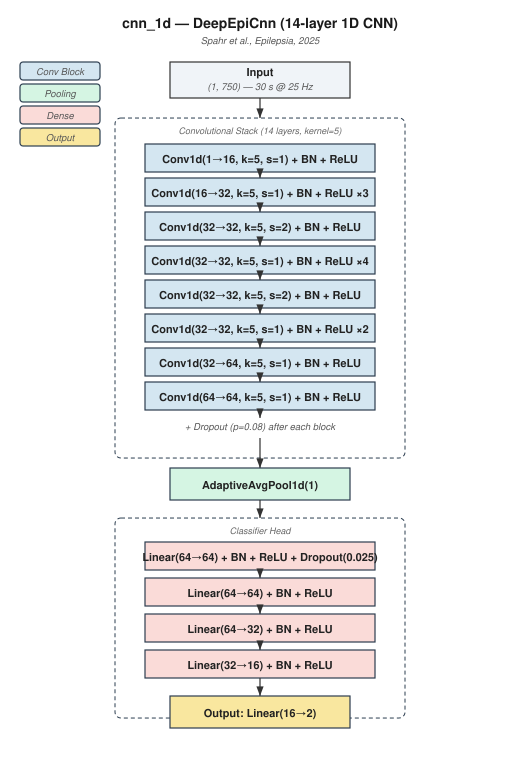
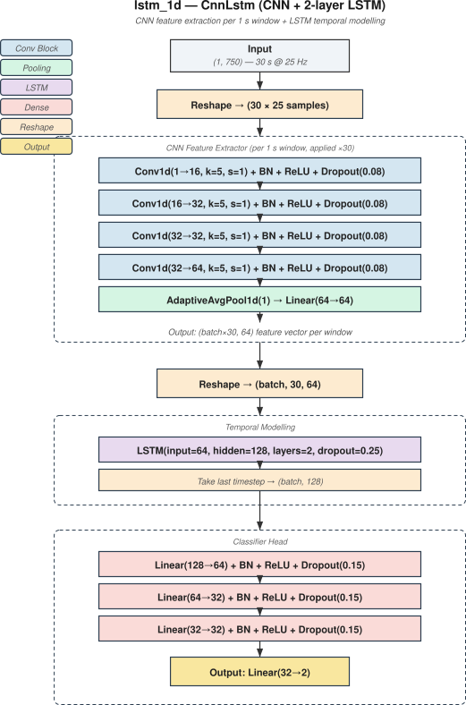
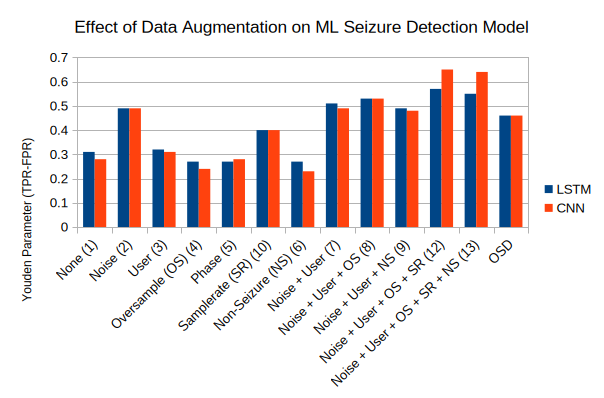

# Development of a Machine Learning Seizure Detection Algorithm for OpenSeizureDetector
V0.1, Graham Jones, 19 September 2026

## Background

### Open Seizure Detector
Open Seizure Detector is a free, Open Source seizure detection and alarm system [1].   It was first released in 2015 and used a deterministic algorithm that would run on a low powered Pebble smart watch.   The system was later ported to Garmin smart watches, but retained the same deterministic algorithm.   More recently support for the low cost PineTime watch has been introduced.

The original, deterministic 'OSD' algorithm works on 5 seconds of accelerometer vector magnitude data, sampled at 25 Hz (so 125 individual samples) [2].   A fourier transform is calculated to determine the spectral power of the measured movement in different frequency bands.   The DC (0 Hz) power is ignored, because this is mostly the acceleration due to gravity.   The spectral power in the 3 Hz to 8 Hz band is compared to the total spectral power.   If the ratio of the 3-8Hz power to total power is more than a threshold value, this is considered 'seizure-like' movement.    If seizure-like movement is detected for 2 consecutive 5 second periods, a warning signal is produced, and if it is detected for 3 consecutive periods, a full alarm condition is initiated.

This system has proved effective for detecting tonic-clonic seizures, especially when linked with a secondary 'flap' detection algirthm which alarms on high amplitude, lower frequency movements.

The disadvantage of this deterministic algorithm is a high false alarm rate - the system will alarm for common movements such as brushing teeth, washing dishes or travelling in a vehicle.

### The Open Seizure Database
A long term intention of the Open Seizure Detector project has been to provide an improved seizure detection algorithm by utilising machine learning to better distinguish between genuine seizure movements  and false alarms.   To facilitate this, the Open Seizure Detector Android application [3] was updated to allow users to (optionally) contribute data to a shared, anonymised database.  This system recorded an 'event', which is 3 minutes of accelerometer and heart rate data, each time the system generated an alarm or warning condition.   Users could then mark the events to say if they were genuine seizures or false alarms, and provide additional information on the type of seizure or cause of the false alarm.

The anonymised version of this user contributed data is published periodically as the Open Seizure Database (OSDB) [4], and made available free of charge to researchers and developers.    It is a requirement of the Open Seizure Database Licence [5], that appropriate attribution is provided for the use of the data, and the results of work using the data are published so that the OpenSeizureDetector users who have contributed the data have the opportunity to benefit from the work.  This report satisfies these licence requirements for the work described below.

The OSDB contains three significant datasets:

  - Seizure Data, which is marked by the user to give a seizure type,  including tonic-clonic, aura or other.   The data includes seizure start and end times that were derived by the database curator by instpection of the accelerometer and heart rate readings.
  - False Alarm Data - this is a set of events for which the OpenSeizureDetector algorithms generated an alarm or warning, but the user has marked as a false alarm - it includes activities such s walking/running/cycling, brushing hair/teeth, cleaning/cooking.
  - Normal Daily Activity (NDA) Data - this is data recorded irrespective of whether a warning or alarm is generated.  It is not annotated, but could be used to give an estimate of true false alarm rate.

Note that it is not straightforward to calculate a true False Alarm Rate (FAR) from the OSDB data because it contains a high proportion of events containing seizure-like movements (such as brushing teeth), so is biased towards generating false alarms.   The 'Normal Daily Activity' (NDA) data, which can be used as an estimate, but even for that, very low movement events are filtered out, so it will not give a true FAR for resting periods.   Therefore the FAR improvement is judged by comparing it to that reported using the original OSD algorithm.

### Performance of other Seizure Detection Devices

Several commercial seizure detection devices have published formal reports of their detection reliability and false alarm rates
  - Empatica Epimonitor - 95% TPR, 0.25/day FAR [6]
  - Epiwatch on Apple Watch - 98% TPR, 0.08/day FAR [7]
  - Nightwatch - 86% TPR, FAR 0.25 per night [8]
  - Emfit Bed Sensor - 70% TPR, FAR 0.007/day [9]

From the above it can be seen that watch based seizure detection devices can approach 90% detection reliability (TPR), with low claimed false alarm rates.   It should be noted that many of the  studies described above were carried out in a hospital setting, so the false alarm rate might not be truly representative of real world performance during normal daily activities.

## Objective

The objective of this work is to develop a machine learning seizure detection algorithm which will produce a similarly high tonic-clonic seizure detection reliability to the original OSD algorithm, but with a significantly lower false alarm rate.

In terms of figures this means an event-level True Positive Rate (TPR) for tonic-clonic seizures of better than 80%, and a calculated False Alarm Rate (FAR) of less than 20% of the negative events in the database.   As stated above, it is not possible to calculate a true FAR (false alarms per day) using the Open Seizure Database - this will need to be determined by users once the optimum model has been deployed.

## Candidate Models

For the purposes of this study, two candidate models have been considered.   These are a 1-dimensional Convolutional Neural Network (CNN) and a 1-dimensional Long-Short Term Memory Neural Network, both operating on 30 seconds of accelerometer vector magnitude data (=750 samples at 25 Hz).    It is intended to extend this work to consider 3-dimensional versions of the models (x, y and z acceleration components) in the future.

### CNN-1D
The structure of this model is inspired by the work of Spahr et. al [10], which claims a TPR of 96% and a FAR of 0.125/day.   It should be noted though that the data supporting this claim was obtained from hospital settings, so the FAR might not be representative the performance during normal daily activities.

The model accepts 750 acceleration vector magnitude values (in units of G), which corresponds to 30 seconds of data at 25 Hz.

The core of the model is a stack of 14 one-dimensional convolutional layers.   The 14 convolutional layers are arranged in sequence, with the number of filters varying so the network initially detects a small number of simple patterns (e.g., sudden changes in acceleration) and gradually learns to combine these into a larger number of more complex representations.

After each convolution, the output is normalized using *batch normalization*, a technique that rescales the activations to have zero mean and unit variance within each mini-batch. This stabilises training and allows higher learning rates to be used.  The original model suffered from over-fitting when used with OSDB data, so a *dropout* layer  was added after each convolutional block to reduce over-fitting.

The layer structure of the model is identical to that described in Spahr et al. (2025), but with significant additional regularisation was added to prevent over-fitting with OSDB data.   The model structure, including regularisation is described in detail in Appendix A.

Global average pooling is used after the convolutional layers to summarise the presence and strength of each detected pattern across the full 30-second window, regardless of when it occurred. This operation also makes the model robust to small shifts in the timing of seizure-related movements.

The output from the pooling layer is passed to a sequence of four *fully connected* (also called *dense*) layers. In a fully connected layer, every input element is connected to every output element through a learned weight, allowing the layer to combine information from all detected patterns simultaneously.   These dense layers also incorporate dropout regularisation to prevent over-fitting.

The fourth and final dense layer maps from 16 dimensions to the number of output classes (in this case 2 for binary seizure/non-seizure classification). This layer produces *un-normalized logits* — raw numerical scores that are passed to a cross-entropy loss function during training, or to a softmax function during inference to obtain class probabilities.

#### Summary of Layer Dimensions for CNN-1D model

| Stage | Input Shape | Operation | Output Shape |
|---|---|---|---|
| Input | — | 30 s @ 25 Hz accelerometer magnitude | (batch, 1, 750) |
| Conv layers 1–14 | (batch, *C*in, *T*) | Conv1D(k=5) → BatchNorm → ReLU → Dropout | (batch, 64, *T*') |
| Global average pooling | (batch, 64, *T*') | Mean across time | (batch, 64) |
| Dense layer 1 | (batch, 64) | Linear → BatchNorm → ReLU → Dropout | (batch, 64) |
| Dense layer 2 | (batch, 64) | Linear → BatchNorm → ReLU → Dropout | (batch, 32) |
| Dense layer 3 | (batch, 32) | Linear → BatchNorm → ReLU → Dropout | (batch, 16) |
| Output layer | (batch, 16) | Linear | (batch, 2) |

See Appendix A for a more complete description and explanation of the model structure.

### LSTM-1D

The LSTM-1D model was inspired by the AMBER model developed by Jamie Pordoy [13].   It has been simplified to be a single mode model, using only accelerometer vector magnitude without the heart rate input used by the AMBER model.

The model consists of three functional stages: (1) a convolutional feature extractor that converts raw accelerometer data into compact feature representations, (2) a recurrent temporal processor that analyses how these features evolve over time, and (3) a classification decision layer that determines whether the observed pattern corresponds to a seizure.

#### 1. CNN Based Feature Extractor

The first stage uses a four-layer one-dimensional convolutional neural network (CNN) to extract features from short segments of the accelerometer signal. Unlike the CNN-1D model, which processes the entire 30-second window at once, the CNN-LSTM divides the input into 30 non-overlapping 1-second windows (each containing 25 samples at 25 Hz) and processes each window independently through the same CNN.

The four convolutional layers have the following configuration:

| Layer | Input Channels | Output Channels | Kernel Size | Output Length | Purpose |
|---|---|---|---|---|---|
| 1 | 1 (magnitude) | 16 | 5 | 22 | Detects basic signal shapes |
| 2 | 16 | 32 | 5 | 19 | Combines basic shapes |
| 3 | 32 | 32 | 5 | 16 | Refines representations |
| 4 | 32 | 64 | 5 | 12 | Produces high-level features |

Each convolutional layer is followed by batch normalization to stabilise training), ReLU activation (which replaces negative values with zero, introducing non-linearity so the network can learn complex patterns), and dropout to reduce over-fitting..

After the four convolutional layers, *global average pooling* is used to produce a 64-dimensional feature vector for each of the 30 one-second sub-windows.

#### 2. LSTM Temporal Processor

The second stage uses a *Long Short-Term Memory* (LSTM) network to process the sequence of 30 feature vectors produced by the CNN. This design enables the network to learn long-range dependencies.

The model uses a two-layer stacked LSTM:

- **First LSTM layer:** Maps the 64-dimensional CNN feature vectors to a 128-dimensional hidden state. At each of the 30 time steps, this layer reads the corresponding CNN feature vector and updates its hidden state to incorporate the new information.
- **Second LSTM layer:** Takes the 128-dimensional hidden state output from the first layer as its input and produces a new 128-dimensional hidden state. This allows the network to learn more abstract temporal patterns by building on the representations learned by the first layer.

Dropout (*p* = 0.25) is applied between the two LSTM layers to regularize the recurrent connections, reducing the risk that the model becomes overly dependent on specific temporal patterns seen during training.

The final hidden state of the sequence (corresponding to the most recent time step, *t* = 30) is retained for classification. This provides a fixed-length 128-dimensional summary that encapsulates the temporal dynamics observed across the entire 30-second input window.

#### 3. Classification Layers

The 128-dimensional vector from the LSTM is passed to a sequence of three *fully connected* (also called *dense*) layers to combine information from all temporal features simultaneously.   Dropout is used between layers to reduce over-fitting, and a softmax function is used during inference to obtain seizure probabilities.

A detailed technical description of the model is presented in Appendix B.

## Data Processing

The dataset used in this work is Version 1.11 of the Open Seizure Database [4].

The data is provided in structured JSON format files for Seizure Data, False Alarm data and Normal Daily Activity (NDA) data, and all three sets of data were used in this analysis.

The 'nnTraining2' toolchain [11] provided bythe OpenSeizureDetector project was used to process the data, train the model and test the model.

The toolchain (runSequence.py) accepts a .json configuration file that describes the processing to be carried out, the model to be used, and the training parameters.   It carries out the following processing sequence:

  1. **Select Data**:  Apply filters to determine which events are selected from which OSDB files - produces a single, consolidated allData.json output file.
  1. **Flatten Data**: Takes the structured json OSDB files and flattens them into .csv files, with one row per 5 second 'datapoint'.
  1. **Split Data**:  Split the data into Train / Validation / Test sets, using either fixed proportions specified in the configuration file, or nested k-fold validation splits [12].   Produces trainData, validationData and testData files.
  1. **Extract Features**:  Extract selected features from the relevant files - several different features can be specified, but in this work only vector magnitude was used.
  1. **Augment Data**:  Apply data augmentation to the training data to reduce over-fitting.   Several different augmentation steps are available, and discussed further under Optimisation below.   The output is a trainDataAugmented.csv file which is used as input to the training step.
  1.  **Train Model**:  Train the Model using the processed data, saving the model based on user-selectable parameters to determine the 'best' model available.  In this work we have used the Youden parameter (TPR-FPR) to select the model that gives the best discrimination between true seizres and non-seizure events.
  1.  **Convert Model for Mobile Processing** - conver the .pt pytorch model to a .pte model that can be executed on a mobile phone.
  1.  **Test Model**:  Test the resulting model (both the .pt and the converted .pte model) and produce statistics and summaries of true positive and false positive results.

## Optimisation

Although the runSequence toolchain provides several augmentation options, experimentation was needed to determine the optimum augmentation settings, based on both training accuracy and computer time and memory limitations.   To do this a baseline configuration file was constructed for each model - [nnConfig_cnn_1D.json](https://github.com/OpenSeizureDetector/OpenSeizureDatabase/blob/c78faefbe86dfb2184b6c578c6b80b5486273703/user_tools/nnTraining2/nnConfig_cnn_1D.json) and [nnConfig_lstm_1D.json](https://github.com/OpenSeizureDetector/OpenSeizureDatabase/blob/c78faefbe86dfb2184b6c578c6b80b5486273703/user_tools/nnTraining2/nnConfig_lstm_1D.json).   Both were configured to train the model using a simple train/validate/test split with proportions 60%/15%/20%.  So 60% of the data is used to train the model, with 15% for validation during training - which includes selecting the 'best' model to be saved.   The 20% of training data is kept back for truly independent testing once training has been completed.

The default configuration files have no data augmentation.  An additional wrapper script, [controller_script.py](https://github.com/OpenSeizureDetector/OpenSeizureDatabase/blob/c78faefbe86dfb2184b6c578c6b80b5486273703/user_tools/nnTraining2/controller_script.py) was used to run the training process multiple times, changing the augmentation configuration between runs.
Some of the runs used only a single augmentation method, and others used combinations.

On completion of all of the runs, the event level Youden parameter (TPR-FPR) was calculated for each testing run and compared as shown below:

From the graph above it can be seen that:
  - Of the individual augmentation runs, noise augmentation produced the biggest benefit in terms of maximising the Youden parameter.
  - User and Sample Rate augmentation gave slight improvements when used individually.
  - Oversampling and Phase augmentation actually gave a slight reduction in parformance compared to the base case of no augmentation, but this might be statistical noise given the uncertainties over the results.
  - The largest Youden value was obtained for the combination of Noise, User, Sample Rate and Random Oversampling (run 12).
  - Run 12 (Noise, User, Sample Rate and Random Oversampling) showed a difference between the CNN and LSTM model performance, with the CNN performing better, whereas most of the other runs showed very similar performance for the two models.   This is discussed below under Training Results

## Training Results

Run 12, which used Noise, User, Sample Rate and Random Oversampling augmentation produced the best performance in terms of Youden parameter (TPR-FPR) for both models, with the CNN having a slightly higher value than the LSTM.

## References

[1]:  Open Seizure Detector:  https://openseizuredetector.org.uk.

[2]:  Deterministic OSD Seizure Detection Algorithm: https://www.openseizuredetector.org.uk/static/osd_pages/pages-user/seizure-detection/original-osd-algorithm.html.

[3]:  Open Seizure Detector Android Application: https://play.google.com/store/apps/details?id=uk.org.openseizuredetector or https://github.com/OpenSeizureDetector/Android_Pebble_SD

[4]:  Pordoy et. al. "The Open Seizure Database - Facilitating Research Into Non-EEG Seizure Detection"; https://doi.org/10.36227/techrxiv.23957625.v1; August 2023

[5]: Open Seizure Database Licence:  https://github.com/OpenSeizureDetector/OpenSeizureDatabase/blob/main/documentation/LICENCE.md

[6]:  Bistoni T, Picard R & Regalia G; "Real-World Performance of an FDA-Cleared Seizure Detector Using a Next-Generation Accelerometer and Electrodermal Activity-Based Wristband" [AES Annual Meeting, 2025](https://aesnet.org/abstractslisting/real-world-performance-of-an-fda-cleared-seizure-detector-using-a-next-generation-accelerometer-and-electrodermal-activity-based-wristband)   

[7]: Krauss, G.L et. al. "Phase III Trial of EpiWatch for Tonic-Clonic Seizure Detection in Children and Adults" [Neurology, 2026](https://www.neurology.org/doi/10.1212/WN9.0000000000000111)

[8]: Arends, J et. al. "Multimodal nocturnal seizure detection in a residential care setting"; [Neurology, 2018](https://nightwatchepilepsy.com/wp-content/uploads/2022/03/Neurology_NightWatch_Multimodal-nocturnal-seizure-detection-in-a-residential-care-setting.pdf)  

[9]: NouBoue C et. al. "Assessment of an under-mattress sensor as a seizure detection tool in an adult epilepsy monitoring unit"; [Seizure 2023](https://www.seizure-journal.com/article/S1059-1311(23)00011-0/fulltext)

[10]: Spahr A, et. al. "Deep learning-based detection of generalized convulsive seizures using a wrist-worn accelerometer"; [Epilepsia. 2025 Sep;66 Suppl 3(Suppl 3):53-63](https://pubmed.ncbi.nlm.nih.gov/40265999/). doi: 10.1111/epi.18406.

[11]: Jones G; Open Seizure Database 'nnTraining2' toolchain.  https://github.com/OpenSeizureDetector/OpenSeizureDatabase/tree/main/user_tools/nnTraining2, Commit c561608.

[12]:  **REFERENCE FOR NESTED K_FOLD VALIDATION**

[13]: Pordoy J et. al. "Enhanced Non-EEG Multimodal Seizure Detection: A Real-World Model for Identifying Generalised Seizures Across the Ictal State"; IEEE J Biomed Health Inform. 2025 May;29(5):3329-3342. doi: 10.1109/JBHI.2025.3532223. Epub 2025 May 6. PMID: 40031183.

## Abbreviations

  - **CNN**:  Convolutional Neural Network
  - **FAR**:  False Alarm Rate
  - **LSTM**: Long, Short Term Memory (neural network)
  - **NDA**:  Normal Daily Activity
  - **OSD**:  Open Seizure Detector
  - **OSDB**: Open Seizure Database
  - **TPR**:  True Positive Rate

# APPENDICES

## Appendix A - Detailed Description of CNN Model

### CNN-1D
The structure of this model is inspired by the work of Spahr et. al [10], which claims a TPR of 96% and a FAR of 0.125/day.   It should be noted though that the data supporting this claim was obtained from hospital settings, so the FAR might not be representative the performance during normal daily activities.

The model accepts 750 acceleration vector magnitude values (in units of G), which corresponds to 30 seconds of data at 25 Hz.

The layer structure of the model is identical to that described in Spahr et al. (2025), but it was found that significant additional regularisation was required to prevent over-fitting with OSDB data.   The model structure, including regularisation is described below.

#### Convolutional Feature Extraction

The core of the model is a stack of 14 one-dimensional convolutional layers. A convolutional layer is a mathematical operation that slides a small window — called a *kernel* or *filter* — across the input signal, computing a dot product at each position to detect local patterns. In this model, each filter has a width of 5 samples, meaning it examines 5 consecutive accelerometer readings at a time. The number of filters (sometimes called *channels*) determines how many different patterns the layer can detect simultaneously.

The 14 convolutional layers are arranged in sequence, with the number of filters progressing as follows: the first layer has 16 filters, the next eleven layers each have 32 filters, and the final two layers each have 64 filters. This progression means the network initially detects a small number of simple patterns (e.g., sudden changes in acceleration) and gradually learns to combine these into a larger number of more complex representations.

Each convolutional layer uses a stride of 1 (meaning the filter moves one sample at a time) except for every fifth layer, which uses a stride of 2 (moving two samples at a time). Stride-2 layers effectively halve the temporal resolution of the signal, allowing the network to process progressively larger regions of the input with fewer computations. The network uses *valid* padding (no zero-padding is added at the edges), so the output of each layer is slightly shorter than its input.

After each convolution, the output is normalized using *batch normalization*, a technique that rescales the activations to have zero mean and unit variance within each mini-batch. This stabilises training and allows higher learning rates to be used. The normalised output is then passed through a *rectified linear unit* (ReLU) activation function, which introduces non-linearity into the model by replacing all negative values with zero. Without non-linear activation functions, a stack of convolutional layers would be mathematically equivalent to a single linear transformation and would be unable to learn complex patterns. A *dropout* layer (probability *p* = 0.08) follows each convolutional block, randomly setting 8% of activations to zero during training to reduce over-fitting.

#### Global Average Pooling

After the 14 convolutional layers, the output is a three-dimensional tensor with shape (batch, 64, *T*), where 64 is the number of filters in the final layer and *T* is the remaining temporal length. *Global average pooling* reduces this to a fixed-length vector by computing the arithmetic mean of each filter's output across the entire time dimension. The result is a single 64-dimensional vector (one value per filter) that summarises the presence and strength of each detected pattern across the full 30-second window, regardless of when it occurred. This operation also makes the model robust to small shifts in the timing of seizure-related movements.

#### Classification Layers

The 64-dimensional vector from the pooling layer is passed to a sequence of four *fully connected* (also called *dense*) layers. In a fully connected layer, every input element is connected to every output element through a learned weight, allowing the layer to combine information from all detected patterns simultaneously.

The first three dense layers transform the feature vector through a series of non-linear transformations with the following dimensions: 64 → 64 → 32 → 16. Each of these layers is followed by batch normalization (as described above), ReLU activation, and *dropout*. Dropout is a regularisation technique that randomly sets a fraction of the layer's outputs to zero during training (here, *p* = 0.15, meaning 15% of activations are dropped). This prevents the network from becoming overly reliant on any single feature and improves generalisation to unseen data. Dropout is disabled during inference (i.e., when making predictions on new data). The dropout rate of 0.15 is substantially higher than the *p* = 0.025 used by Spahr et al. (2025), reflecting a stronger regularisation regime.

The fourth and final dense layer maps from 16 dimensions to the number of output classes (2 for binary seizure/non-seizure classification). This layer produces *un-normalized logits* — raw numerical scores that are passed to a cross-entropy loss function during training, or to a softmax function during inference to obtain class probabilities.

#### Summary of Layer Dimensions

| Stage | Input Shape | Operation | Output Shape |
|---|---|---|---|
| Input | — | 30 s @ 25 Hz accelerometer magnitude | (batch, 1, 750) |
| Conv layers 1–14 | (batch, *C*in, *T*) | Conv1D(k=5) → BatchNorm → ReLU → Dropout | (batch, 64, *T*') |
| Global average pooling | (batch, 64, *T*') | Mean across time | (batch, 64) |
| Dense layer 1 | (batch, 64) | Linear → BatchNorm → ReLU → Dropout | (batch, 64) |
| Dense layer 2 | (batch, 64) | Linear → BatchNorm → ReLU → Dropout | (batch, 32) |
| Dense layer 3 | (batch, 32) | Linear → BatchNorm → ReLU → Dropout | (batch, 16) |
| Output layer | (batch, 16) | Linear | (batch, 2) |

#### Total Parameters

The complete model comprises approximately 97,362 trainable parameters:

| Component | Parameters | Proportion |
|---|---|---|
| Convolutional layers | 86,048 | 88% |
| Batch normalization | 352 | <1% |
| Dense/linear layers | 10,962 | 11% |
| **Total** | **97,362** | **100%** |

## Appendix B - Detailed Description of LSTM Model

### LSTM-1D

The model consists of three functional stages: (1) a convolutional feature extractor that converts raw accelerometer data into compact feature representations, (2) a recurrent temporal processor that analyses how these features evolve over time, and (3) a classification decision layer that determines whether the observed pattern corresponds to a seizure.

#### 1. CNN Feature Extractor

The first stage uses a four-layer one-dimensional convolutional neural network (CNN) to extract features from short segments of the accelerometer signal. Unlike the `deepEpiCnn` model, which processes the entire 30-second window at once, the CNN-LSTM divides the input into 30 non-overlapping 1-second windows (each containing 25 samples at 25 Hz) and processes each window independently through the same CNN.

A convolutional layer slides a small window — called a *kernel* or *filter* — across the input signal, computing a dot product at each position to detect local patterns. In this model, each filter has a width of 5 samples, meaning it examines 5 consecutive accelerometer readings at a time. The number of filters (sometimes called *channels*) determines how many different patterns the layer can detect simultaneously.

The four convolutional layers have the following configuration:

| Layer | Input Channels | Output Channels | Kernel Size | Output Length | Purpose |
|---|---|---|---|---|---|
| 1 | 1 (magnitude) | 16 | 5 | 22 | Detects basic signal shapes |
| 2 | 16 | 32 | 5 | 19 | Combines basic shapes |
| 3 | 32 | 32 | 5 | 16 | Refines representations |
| 4 | 32 | 64 | 5 | 12 | Produces high-level features |

Each convolutional layer is followed by batch normalization (which rescales activations to have zero mean and unit variance, stabilising training), ReLU activation (which replaces negative values with zero, introducing non-linearity so the network can learn complex patterns), and dropout (which randomly sets a fraction of activations to zero during training to prevent overfitting; default *p* = 0.08, meaning 8% of activations are dropped).

After the four convolutional layers, *global average pooling* computes the arithmetic mean of each filter's output across the time dimension, reducing the (batch, 64, 12) tensor to a (batch, 64) vector. This vector is then projected to a 64-dimensional feature vector through a linear (fully connected) layer.

This extractor is applied independently to each of the 30 one-second sub-windows, producing a sequence of 30 feature vectors of dimension 64. This sequence represents the temporal evolution of accelerometer patterns over the full 30-second observation window.

#### 2. LSTM Temporal Processor

The second stage uses a *Long Short-Term Memory* (LSTM) network to process the sequence of 30 feature vectors produced by the CNN. An LSTM is a type of recurrent neural network (RNN) that maintains an internal *hidden state* — a running summary of the information it has seen so far — which allows it to capture temporal dependencies across the sequence. Unlike a simple RNN, an LSTM uses *gating mechanisms* (input, forget, and output gates) that control how much new information to incorporate, how much old information to retain, and how much of the hidden state to expose at each time step. This design enables the network to learn long-range dependencies.

The model uses a two-layer stacked LSTM:

- **First LSTM layer:** Maps the 64-dimensional CNN feature vectors to a 128-dimensional hidden state. At each of the 30 time steps, this layer reads the corresponding CNN feature vector and updates its hidden state to incorporate the new information.
- **Second LSTM layer:** Takes the 128-dimensional hidden state output from the first layer as its input and produces a new 128-dimensional hidden state. This allows the network to learn more abstract temporal patterns by building on the representations learned by the first layer.

Dropout (*p* = 0.25) is applied between the two LSTM layers to regularize the recurrent connections, reducing the risk that the model becomes overly dependent on specific temporal patterns seen during training.

Only the final hidden state of the sequence (corresponding to the most recent time step, *t* = 30) is retained for classification. This provides a fixed-length 128-dimensional summary that encapsulates the temporal dynamics observed across the entire 30-second input window.

#### 3. Classification Layers

The 128-dimensional vector from the LSTM is passed to a sequence of three *fully connected* (also called *dense*) layers. In a fully connected layer, every input element is connected to every output element through a learned weight, allowing the layer to combine information from all temporal features simultaneously.

The three dense layers have the following dimensions: 128 → 64 → 32 → 2. Each of the first three layers is followed by batch normalization (rescaling activations to stabilise training), ReLU activation (replacing negative values with zero to introduce non-linearity), and dropout (*p* = 0.15, meaning 15% of activations are randomly set to zero during training to prevent overfitting). The fourth and final layer maps from 32 dimensions to the two output classes (seizure vs. non-seizure), producing *un-normalized logits* — raw numerical scores that are passed to a cross-entropy loss function during training, or to a softmax function during inference to obtain class probabilities.

#### Total Parameters

The complete model comprises approximately 281,000 trainable parameters:

| Component | Parameters | Proportion |
|---|---|---|
| CNN feature extractor | ~20,000 | 7% |
| LSTM layers | ~240,000 | 85% |
| Classification layers | ~21,000 | 8% |
| **Total** | **~281,000** | **100%** |

For comparison, the pure CNN model described above has approximately 97k parameters — so this model has roughly three times as many parameters. The majority of the CNN-LSTM's parameters reside in its LSTM layers (85%), whereas the `deepEpiCnn` model concentrates 88% of its parameters in the convolutional layers, reflecting the absence of recurrent connections.
